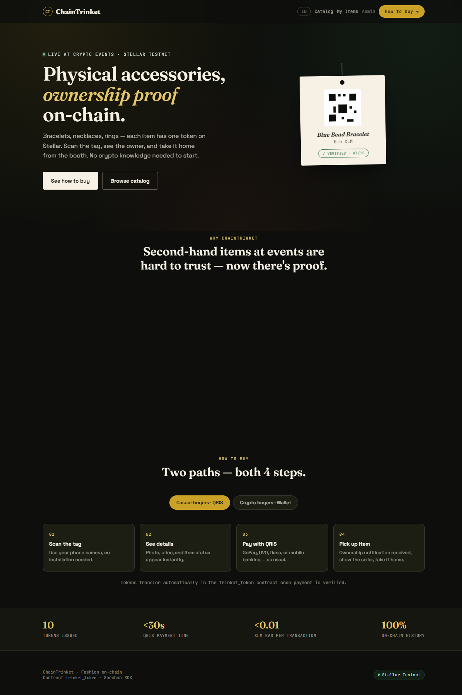
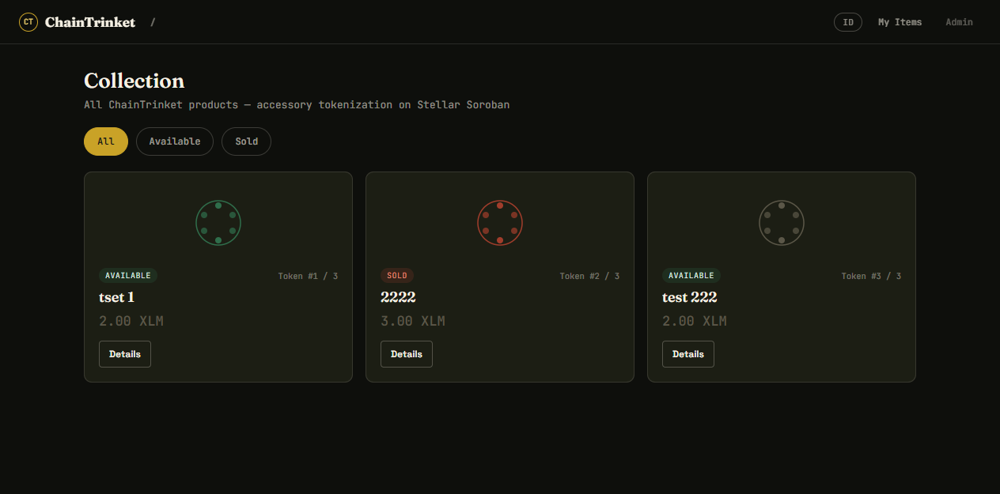
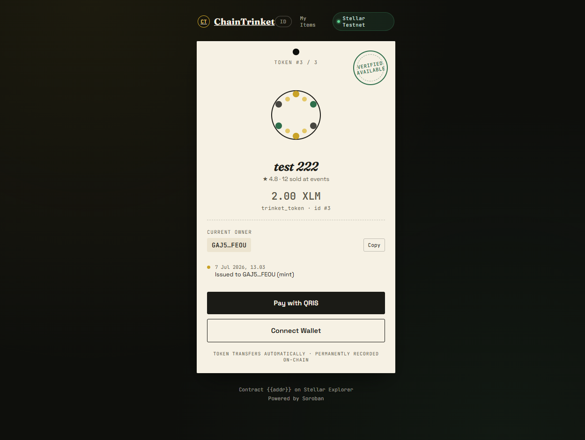
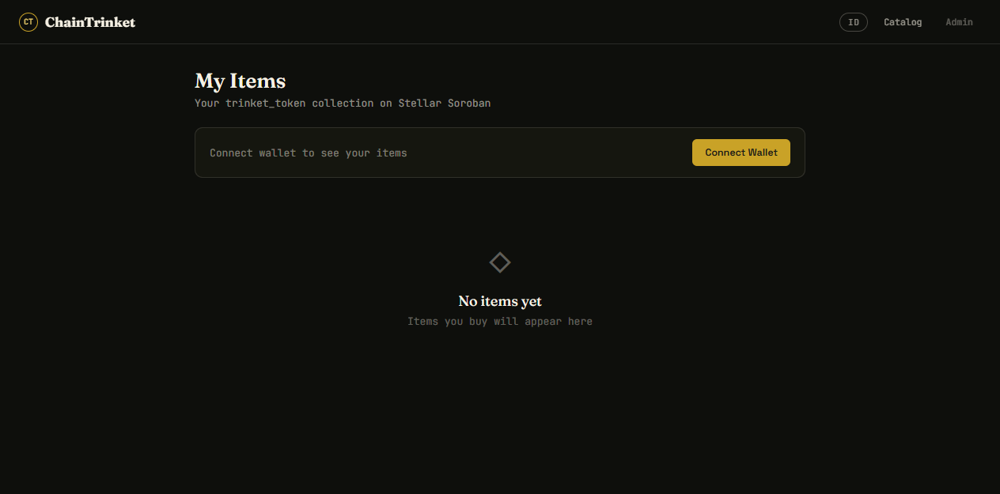
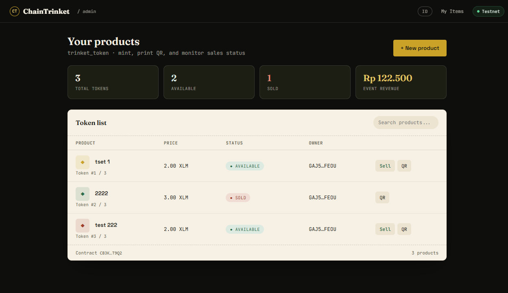

# ChainTrinket
Aksesoris fisik dengan bukti kepemilikan digital di Stellar Soroban.



## Pages

| Page | Screenshot | Description |
|------|-----------|-------------|
| **Home** |  | Landing page — hero, how-to-buy guide, stats |
| **Catalog** |  | Product grid with filter + skeleton loading |
| **Product Detail** |  | Token detail, owner history, buy buttons (QRIS / Wallet) |
| **My Items** |  | React-based page — wallet connect, owned tokens, transfer |
| **Admin** |  | Dashboard — mint, sell, QR print, token list |

## Cara Menjalankan

### 1. Persiapan
- **Freighter Wallet** — Install extension [Freighter](https://www.freighter.app/) di browser Chrome/Edge/Firefox.
- **Akun Testnet** — Buka Freighter → Settings → Network → pilih **Testnet**. Isi saldo lewat [Friendbot](https://friendbot.stellar.org/) (ketik alamat wallet di URL, enter).
- **Wallet Admin** — Pastikan wallet yang dipake admin punya saldo XLM testnet.

### 2. Jalankan Website
Buka file HTML langsung di browser (cukup double-click) atau serve via Python:

```bash
cd site
python -m http.server 8000
# → http://127.0.0.1:8000/home.html
```

| File | Fungsi |
|------|--------|
| `home.html` | Landing page ChainTrinket |
| `catalog.html` | Katalog semua produk |
| `product.html?id=1` | Detail produk (bisa dari scan QR) |
| `my-items.html` | Barang saya — wallet connect + transfer |
| `admin.html` | Dashboard admin — mint, stok, QR |
| `deployer.html` | Deploy ulang contract (kalo perlu) |

### 3. Admin — Init Contract (Pertama Kali)
1. Buka `admin.html`
2. Klik **Connect Freighter** — pilih wallet admin
3. Akan muncul banner **Init Contract** — klik tombolnya
4. Konfirmasi transaksi di Freighter
5. Banner hilang → dashboard siap

### 4. Admin — Mint Produk Baru
1. Klik **+ Produk baru**
2. Isi nama produk & harga (XLM)
3. Klik **Mint & generate QR**
4. Konfirmasi di Freighter
5. QR muncul — bisa dicetak (4×4 cm)

### 5. Pembeli — Bayar & Ambil
**QRIS (offline booth):**
- Scan QR → bayar via QRIS (GoPay/OVO/Dana)
- Tunjukkin bukti ke seller

**Wallet (crypto):**
- Connect Freighter → tap **Buy Now**
- Bayar XLM langsung ke admin
- Tunjukkin bukti ke seller

Seller transfer token di admin → otomatis jadi **Sold**.

### 6. Halaman My Items (React)
- Connect wallet → lihat semua token milikmu
- Tombol **Transfer** → kirim token ke wallet lain
- Bahasa ID/EN via toggle

---

## Struktur File
```
site/
├── home.html          Landing page
├── catalog.html       Katalog produk
├── product.html       Detail produk (scan QR)
├── my-items.html      Barang Saya — React CDN
├── admin.html         Dashboard admin
├── deployer.html      Deploy ulang contract
├── js/
│   ├── ct.js          Core library (Stellar SDK wrapper)
│   └── i18n.js        Bilingual ID/EN
└── README.md          File ini
```

## Tech Stack
- **Blockchain** — Stellar Soroban (Testnet)
- **Smart Contract** — Rust (`soroban-sdk` v21)
- **Frontend** — HTML/JS + React 18 via CDN (my-items.html)
- **Wallet** — Freighter (`@stellar/freighter-api`)
- **SDK** — `@stellar/stellar-sdk` v16 (via CDN)
- **i18n** — Custom lightweight (ID/EN, localStorage)
- **Contract ID** — `CAFLM7AZ2HFJ3FX6SRYNYELAMPIPRVJULNVV4HYJN6TLQFUORCK57ECS`
